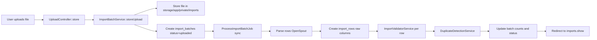

# TenderAI Import Pipeline (Phase 3)

Phase 3 implements **raw Excel/CSV import only**. Data is preserved in `import_rows` for Phase 4 standardization. No AI, bid records, or pricing statistics are created in this phase.

## Parser Package

**[OpenSpout](https://github.com/openspout/openspout) v4.28** (`openspout/openspout`)

| Reason | Detail |
|--------|--------|
| Chosen over Maatwebsite Excel | Lighter, read-focused, no PhpSpreadsheet dependency stack |
| Laravel 12 / PHP 8.2 | v5.x requires PHP 8.4+; v4.28 supports PHP 8.2 |
| Formats | **CSV**, **XLSX** (Office Open XML) |
| Limitation | Legacy **.xls** (BIFF) is not supported; users should save as `.xlsx` |

## Queue Processing

`ProcessImportBatchJob` implements `ShouldQueue`, but Phase 3 calls **`dispatchSync()`** so imports complete immediately without `php artisan queue:work`.

`.env` may still have `QUEUE_CONNECTION=database` for future async processing. To switch to async later, change `ImportBatchService::storeUpload()` to `dispatch()` and run a queue worker.

## Upload Flow

## Storage

| Setting | Value |
|---------|--------|
| Disk | `local` → `storage/app/private` |
| Path | `imports/{uuid}.{ext}` |
| Visibility | Private (not in `public/`) |

Config: `config/import.php`

## Data Entry Hub (`/uploads`)

See also [DATA_ENTRY_HUB.md](./DATA_ENTRY_HUB.md).

| Mode | Route | Creates | Pipeline |
|------|-------|---------|----------|
| **Excel upload** | `POST /uploads` | `import_batches` + `import_rows` | standardize → materialize → stats |
| **Manual historical row** | `POST /uploads/manual` | `import_batches` (`source_type=manual`) + one `import_row` | same as Excel |
| **Upcoming tender** | `POST /uploads/upcoming-tenders` | `tenders` (`status=upcoming`) + `tender_items` | **No** import rows or bid records |

**Historical** data (Excel + manual) = awarded winning bids for analytics. **Upcoming** tenders = future opportunities for prediction context only.

## Routes

| Method | URI | Name | Controller |
|--------|-----|------|------------|
| GET | `/uploads` | `uploads.index` | `UploadController@index` |
| POST | `/uploads` | `uploads.store` | `UploadController@store` |
| POST | `/uploads/manual` | `uploads.manual.store` | `UploadController@manualStore` |
| POST | `/uploads/upcoming-tenders` | `uploads.upcoming-tenders.store` | `UploadController@storeUpcomingTender` |
| GET | `/imports` | `imports.index` | `ImportBatchController@index` |
| GET | `/imports/{import}` | `imports.show` | `ImportBatchController@show` |
| GET | `/imports/{import}/preview` | `imports.preview` | `ImportBatchController@preview` |
| DELETE | `/imports/{import}` | `imports.destroy` | `ImportBatchController@destroy` |

## Expected Excel Columns

**All 13 columns must be present** in the first row. If any canonical field cannot be mapped, the batch is marked `failed`, no rows are imported, and the user sees which labels are missing.

Per-column matching is case/spacing insensitive; common aliases are accepted (e.g. `Tender Number` → `Tender #`):

| Canonical field | Required label (UI) | Example aliases |
|-----------------|-----------------|
| Code | Code, Product Code |
| INN | INN |
| Product Name | Product Name, Drug Name |
| Country | Country |
| Tender # | Tender #, Tender Number |
| Awarded price | Awarded price |
| Price USD | Price USD |
| Winner | Winner |
| Company Name | Company Name, Company |
| Version | Version |
| Year | Year |
| Qty | Qty, Quantity |
| Tender Value | Tender Value |

## Raw Row Philosophy

1. Every spreadsheet row becomes one `import_rows` record.
2. Raw cell values are stored in dedicated `raw_*` string columns **exactly as read** (no type coercion at ingest).
3. Full row payload is also stored in `raw_data` JSON (`by_header` + `canonical` map).
4. `normalized_data` JSON holds parsed numbers/text for validation and hashing only.
5. **Invalid rows are never dropped.**

## Validation Rules

### Required for `valid`

- **Price USD**: present, numeric, &gt; 0
- **Country**: non-empty
- **Year**: present and parseable (1900–2100)
- **Drug identity**: at least one of Code, INN, Product Name

### Warnings (`warning` status)

- Qty missing/invalid
- Tender # missing
- Company Name and Winner both missing
- Tender Value missing
- Awarded price missing

### Invalid (`invalid` status)

- Fails any required rule; `error_message` explains why
- Row is still stored

## Duplicate Detection

`row_hash` = SHA-256 of normalized:

`tender_number | country | year | code | inn | product_name | company_or_winner | price_usd | qty`

| Type | Behavior |
|------|----------|
| Intra-batch | Second+ row with same hash → `duplicate`, link in `import_row_duplicates` |
| Cross-batch | Hash exists in another batch → `duplicate`, link to first existing row |
| Invalid + duplicate | Keeps `invalid` status (duplicate flag not applied) |

## Batch Statuses

| Status | Meaning |
|--------|---------|
| `uploaded` | File saved, job starting |
| `parsing` | Reading spreadsheet |
| `validating` | Writing rows + validation |
| `completed` | All rows valid |
| `completed_with_errors` | One or more invalid rows |
| `failed` | Parse/storage error, or **missing required headers** (no rows created) |

## Batch Metadata Counts

Stored in `import_batches.metadata`:

- `valid_rows`, `invalid_rows`, `warning_rows`, `duplicate_rows`, `review_pending_rows`
- `mapped_headers`, `detected_headers`

Column fields: `row_count`, `success_count`, `error_count`, `duplicate_count`

## What Phase 3 Does NOT Do

- Drug/company/tender standardization
- `standardized_drug_id`, `company_id`, `tender_id`, `bid_record_id` population
- OpenAI / AI usage logs
- Pricing statistics or predictions
- Dynamic dashboard data wiring

## Phase 4 — Standardization & Materialization

**Phase 4A** — `php artisan imports:standardize` — see [STANDARDIZATION_ENGINE.md](./STANDARDIZATION_ENGINE.md)

**Phase 4B** — `php artisan imports:materialize` — see [MATERIALIZATION_ENGINE.md](./MATERIALIZATION_ENGINE.md)

Import batch show page includes materialization summary and **Materialize Batch** action (`POST /imports/{import}/materialize`).

## Services

| Class | Responsibility |
|-------|----------------|
| `ImportParserService` | OpenSpout read, header map, row payloads |
| `ImportValidatorService` | Rules, warnings, normalized_data |
| `DuplicateDetectionService` | row_hash, duplicate links |
| `ImportBatchService` | Orchestration, storage, batch finalize, manual entry |
| `ManualImportService` | Thin wrapper for manual historical rows |
| `UpcomingTenderService` | Upcoming `tenders` + `tender_items` (no bids) |

## Manual Test Fixture

`tests/fixtures/sample_tender_import.csv` — 5 rows (1 invalid missing country, 1 duplicate of row 1).
