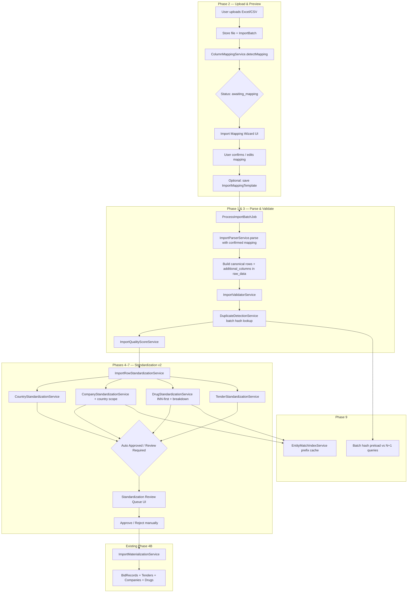

# TenderAI Smart Import & Standardization Engine v2 — Implementation Report

**Date:** 2026-05-31  
**Scope:** Strategic upgrade of the import pipeline (Phases 1–10)

---

## 1. Architecture Diagram



---

## 2. New Import Flow

| Step | Action | Outcome |
|------|--------|---------|
| 1 | Upload file at `/uploads` | File stored; batch status = `awaiting_mapping` |
| 2 | Redirect to `/imports/{id}/mapping` | Auto-detected columns, confidence, missing/extra fields |
| 3 | User accepts/edits mapping, optionally saves template | `confirmed_mapping` stored in batch metadata |
| 4 | Click **Continue Import** | Rows parsed, validated, deduplicated |
| 5 | Batch show page | Import Quality Score displayed |
| 6 | Run standardization | Multi-layer drug/company/country matching |
| 7 | Review queue | Approve/reject rows with low confidence |
| 8 | Materialize | Unchanged downstream pipeline |

**Backward compatibility:** Existing fixture CSVs (`Code, INN, Product Name, … Qty, …`) auto-map with 100% confidence. Manual entry bypasses the wizard. Internal canonical field `quantity` accepts legacy alias `qty`.

---

## 3. Files Modified

| File | Change |
|------|--------|
| `config/import.php` | Canonical fields, alias registry, country aliases, quality thresholds |
| `app/Services/Import/ImportParserService.php` | Smart mapping integration, extra columns, two-phase parse |
| `app/Services/Import/ImportBatchService.php` | Mapping preview, confirm flow, quality score |
| `app/Services/Import/ImportValidatorService.php` | `quantity` canonical support |
| `app/Services/Import/DuplicateDetectionService.php` | Batch hash preload |
| `app/Services/Standardization/DrugStandardizationService.php` | INN-first, confidence breakdown, indexed candidates |
| `app/Services/Standardization/CompanyStandardizationService.php` | Country-scoped matching |
| `app/Services/Standardization/CountryStandardizationService.php` | Config aliases, review flags, no auto-create |
| `app/Services/Standardization/ImportRowStandardizationService.php` | Review items, approve/reject, entity cache |
| `app/Support/Normalization/TextNormalizer.php` | Country aliases from config |
| `app/Enums/ImportBatchStatus.php` | Added `awaiting_mapping` |
| `app/Http/Controllers/UploadController.php` | Redirect to mapping wizard |
| `app/Http/Controllers/ImportBatchController.php` | Mapping + confirm actions, quality score |
| `app/Http/Controllers/StandardizationController.php` | Approve/reject row actions |
| `routes/web.php` | New import mapping + standardization routes |
| `resources/views/imports/mapping.blade.php` | **New** — Import Preview Wizard |
| `resources/views/imports/show.blade.php` | Quality score display |
| `resources/views/standardization/index.blade.php` | Review items, approve/reject |
| `resources/views/components/import-status-badge.blade.php` | `awaiting_mapping` badge |
| `tests/Feature/ImportPipelineTest.php` | Mapping wizard flow + new scenarios |
| `tests/Feature/StandardizationEngineTest.php` | Country-aware company test updates |
| `tests/Unit/ColumnMappingServiceTest.php` | **New** |

---

## 4. New Services

| Service | Responsibility |
|---------|----------------|
| `ColumnMappingService` | Header normalization, exact/alias/fuzzy matching, missing/extra detection |
| `ImportQualityScoreService` | 0–100 batch score with Excellent/Good/Needs Review/Poor ratings |
| `EntityMatchIndexService` | Prefix-indexed drug/company candidate lookup; batch cache |

---

## 5. New Tables

| Table | Purpose |
|-------|---------|
| `import_mapping_templates` | Persist user-defined column mappings for reuse |

**Migration:** `2026_05_31_100001_create_import_mapping_templates_table.php`

---

## 6. New UI Screens

| Route | Screen |
|-------|--------|
| `GET /imports/{import}/mapping` | **Import Preview & Column Mapping Wizard** |
| `POST /imports/{import}/mapping` | Confirm mapping and start import |
| `POST /standardization/rows/{row}/approve` | Manually approve review row |
| `POST /standardization/rows/{row}/reject` | Reject review row |

Enhanced existing screens:
- Import batch show — Import Quality Score card
- Standardization index — per-entity review items with reason + confidence breakdown

---

## 7. Migration Impact

- **Run:** `php artisan migrate`
- Adds `import_mapping_templates` only — no changes to `import_rows` / `import_batches` schema
- Extra column data stored in existing `raw_data` JSON (`additional_columns`, `extra_columns`)
- Mapping metadata stored in existing `import_batches.metadata` JSON
- Quality score stored in `metadata.import_quality_score`, `import_quality_rating`, `import_quality_breakdown`

---

## 8. Backward Compatibility Notes

| Area | Behavior |
|------|----------|
| Standard CSV format | Auto-maps all 13 fields; wizard pre-filled |
| Legacy `qty` header | Maps to canonical `quantity`; DB column remains `raw_qty` |
| `config/import.php` `expected_columns` | Retained as deprecated alias of `column_aliases` |
| Manual historical entry | Unchanged — skips wizard |
| Materialization | Unchanged — still requires approved/auto-approved rows |
| Country creation | Never auto-created (unchanged, now enforced in review queue) |
| Upload UX | **Changed** — requires mapping confirmation step (intentional v2 behavior) |

---

## 9. Performance Improvements

| Before | After |
|--------|-------|
| Drug fuzzy: `StandardizedDrug::all()` per row | Prefix-indexed query + 50 candidate cap via `EntityMatchIndexService` |
| Company fuzzy: `Company::all()` per row | Country-scoped prefix query + candidate cap |
| Cross-batch duplicate: 1 query per row | Single batch preload of existing hashes |
| Country list: loaded per row | Static cache per request in `CountryStandardizationService` |
| Standardization batch | `EntityMatchIndexService::clearCache()` per chunk |

**Target scale:** Designed for 100k import rows / 500k bid records with indexed lookups instead of O(rows × entities) full scans.

---

## 10. Future Enhancements

1. **Admin settings UI** — Edit `column_aliases` and `country_aliases` from Settings (config already structured for this)
2. **Async import processing** — Replace `dispatchSync()` with queued job for large files
3. **Apply saved templates on upload** — Auto-select template by filename pattern or user preference
4. **MySQL FULLTEXT / Elasticsearch** — Replace prefix LIKE for drug/product search at 1M+ scale
5. **Chained pipeline** — Auto-standardize after import when quality score ≥ threshold
6. **Row-level mapping overrides** — Handle multi-header-row files or merged cells
7. **Legacy `.xls` support** — Dedicated BIFF reader or remove from allowed extensions
8. **Mapping confidence ML** — Learn from approved templates to improve fuzzy header scores

---

## Canonical Fields (Internal Pipeline)

```
code, inn, product_name, country, tender_number, awarded_price,
price_usd, winner, company_name, version, year, quantity, tender_value
```

## Required Mapping Minimum

- `country`, `year`, `price_usd`
- At least one of: `code`, `inn`, `product_name`

All other canonical fields are optional (warnings at validation, not import failure).

---

## Test Coverage

```
Tests\Unit\ColumnMappingServiceTest — alias, fuzzy, extra columns
Tests\Feature\ImportPipelineTest — wizard flow, duplicates, extra columns, QTY mapping
Tests\Feature\StandardizationEngineTest — country aliases, country-scoped company matching
```

Run: `php artisan test --filter="ImportPipeline|ColumnMapping|StandardizationEngine"`
