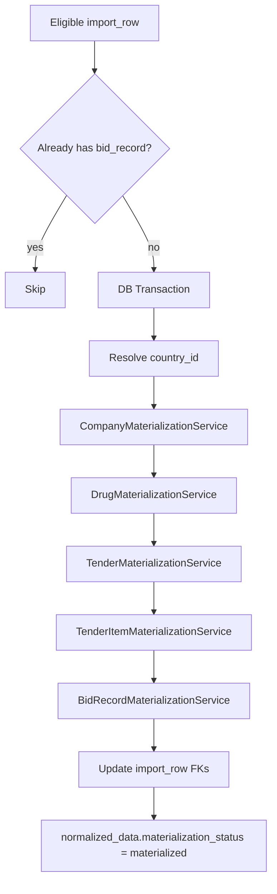

# Materialization Engine (Phase 4B)

Phase 4B converts **standardized, approved** `import_rows` into analytics-ready domain records. Raw import data is never deleted or overwritten.

## Scope

| In scope | Out of scope |
|----------|----------------|
| Companies, aliases, standardized drugs, drug aliases | OpenAI / AI APIs |
| Tenders, tender items, bid records | Prediction engine |
| Import row FK updates | Pricing statistics (Phase 5: `stats:refresh` — see [PRICING_STATISTICS_ENGINE.md](PRICING_STATISTICS_ENGINE.md)) |
| Idempotent materialization per `source_import_row_id` | Frontend redesign |
| Batch metadata counts | Manual approve workflow UI |
| Analytics-ready `bid_records` for Phase 5 stats | Pricing statistics calculation (see [PRICING_STATISTICS_ENGINE.md](PRICING_STATISTICS_ENGINE.md)) |

## Eligible rows

Materialization runs only when:

- `validation_status` ∈ `valid`, `warning`
- `standardization_status` ∈ `auto_approved`, `approved`
- `normalized_data.price_usd` is numeric and > 0
- Resolved `country_id` in `normalized_data`
- Drug identity present (code, INN, or product name)
- Company identity present (company name or winner)
- Tender number present (raw or normalized)

**Not materialized:** `review_required`, `rejected`, `skipped`, `invalid`, `duplicate`.

## Flow



## Services

| Service | Responsibility |
|---------|----------------|
| `ImportMaterializationService` | Orchestrator, eligibility, batch stats, transactions |
| `CompanyMaterializationService` | Find/create company + aliases |
| `DrugMaterializationService` | Find/create standardized drug + aliases |
| `TenderMaterializationService` | Find/create tender by identity |
| `TenderItemMaterializationService` | One item per `source_import_row_id` |
| `BidRecordMaterializationService` | One bid per `source_import_row_id` |

## Bid record defaults (current imports)

Winning awarded rows from Excel:

- `bid_status` = `awarded`
- `is_winner` = `true`
- `row_type` = `winning_bid`
- `is_analytics_ready` = `true`
- `excluded_from_stats` = `false`

## Idempotency

- Skip rows with existing `bid_record_id` or existing `bid_records.source_import_row_id`
- `tender_items.source_import_row_id` is **unique** — prevents duplicate items
- Re-running materialization is safe

## Alias behavior

**Company** (`source` = `import`):

| Alias type | Values |
|------------|--------|
| `company_name` | `raw_company_name`, normalized name |
| `winner` | `raw_winner` |

**Drug**:

| Alias type | Values |
|------------|--------|
| `product_name` | `raw_product_name` |
| `code` | `raw_code` |
| `inn` | `raw_inn` |

Existing aliases increment `usage_count` instead of duplicating.

## Artisan command

```bash
php artisan imports:materialize
php artisan imports:materialize --batch=1
php artisan imports:materialize --limit=50
php artisan imports:materialize --dry-run
php artisan imports:materialize --only-approved=false
```

## Web action

`POST /imports/{import}/materialize` → `ImportBatchController@materialize`

## Batch metadata

After materialization:

- `materialized_rows`
- `persisted_rows`

Per-row tracking in `normalized_data`:

- `materialization_status`: `materialized` | `failed`
- `materialization_error` on failure

## Local manual testing

1. Upload sample CSV via `/uploads`
2. `php artisan imports:standardize --only-pending`
3. `php artisan db:seed --class=StandardizationReferenceSeeder` (if entities missing)
4. `php artisan imports:materialize --batch=1`
5. Open `/imports/{id}` for materialization summary

## Phase 5 (next)

- Pricing statistics aggregation
- Prediction engine inputs
- Optional AI assist for `review_required` rows
- Approve/reject workflow linking suggestions to materialization
