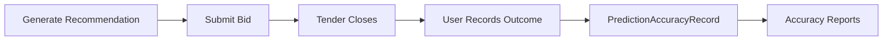

# Outcome Tracking — Architecture Proposal

**Date:** 2026-05-31  
**Status:** Proposal only — no migration implemented

---

## Objective

Track whether tender recommendations led to wins or losses, and measure pricing accuracy against actual outcomes.

---

## Existing Foundation

| Asset | Location | Relevance |
|-------|----------|-----------|
| `prediction_accuracy_records` table | Migration `2026_05_25_100007` | Already has `predicted_price`, `actual_price`, `price_error_pct`, `won`, `outcome_status`, `metadata`, `evaluated_at` |
| `PredictionAccuracyRecord` model | `app/Models/PredictionAccuracyRecord.php` | Relationship to `Prediction` |
| `predictions.tender_id` | Predictions table | Links recommendation to tender (now mandatory for new records) |
| Context snapshots | `prediction_context_snapshots` | Immutable record of inputs at generation time |

---

## Proposed Data Model Extensions

### Phase 1 — Extend `prediction_accuracy_records` (future migration)

```sql
ALTER TABLE prediction_accuracy_records ADD COLUMN actual_winner_price DECIMAL(12,6) NULL;
ALTER TABLE prediction_accuracy_records ADD COLUMN difference_pct DECIMAL(8,4) NULL;
ALTER TABLE prediction_accuracy_records ADD COLUMN submission_date DATE NULL;
ALTER TABLE prediction_accuracy_records ADD COLUMN outcome_date DATE NULL;
ALTER TABLE prediction_accuracy_records ADD COLUMN tender_id BIGINT UNSIGNED NULL;
ALTER TABLE prediction_accuracy_records ADD FOREIGN KEY (tender_id) REFERENCES tenders(id) ON DELETE SET NULL;
```

| Field | Purpose |
|-------|---------|
| `actual_winner_price` | Winning bid price observed after tender close |
| `won` | Boolean — did the user's company win? (existing) |
| `difference_pct` | `(recommended - actual_winner) / actual_winner * 100` |
| `submission_date` | When the bid was submitted |
| `outcome_date` | When tender outcome was recorded |
| `outcome_status` | Extended enum: `pending`, `won`, `lost`, `cancelled`, `no_bid` |

### Phase 2 — Optional `prediction_outcomes` service layer

```
app/Services/Prediction/PredictionOutcomeService.php
  - recordOutcome(Prediction $prediction, OutcomeInput $input): PredictionAccuracyRecord
  - calculateDifferencePct(float $recommended, float $actualWinner): float
  - pendingOutcomes(User $user): Collection
```

### Phase 3 — UI surfaces

1. **Result page:** "Record Outcome" action (when tender closes)
2. **History page:** Outcome badge (Won / Lost / Pending)
3. **Reports:** Accuracy dashboard — avg difference %, win rate by confidence band

---

## Workflow



---

## Integration Points

1. **Tender show page:** Link to related predictions; prompt outcome entry when tender status = closed
2. **Import pipeline:** Auto-populate `actual_winner_price` from new award bid records matching tender + drug
3. **AI narrative (future):** Include outcome history in context for users with sufficient tracked outcomes

---

## Non-Goals (this phase)

- No automatic outcome detection
- No migration created
- No UI for outcome entry
- No changes to pricing engine based on outcomes

---

## Enterprise Readiness Checklist

- [ ] Migration for extended accuracy fields
- [ ] `PredictionOutcomeService` with validation
- [ ] Authorization: only prediction owner can record outcome
- [ ] Audit log for outcome changes
- [ ] Bulk outcome import from tender results
- [ ] Accuracy metrics in dashboard/reports
