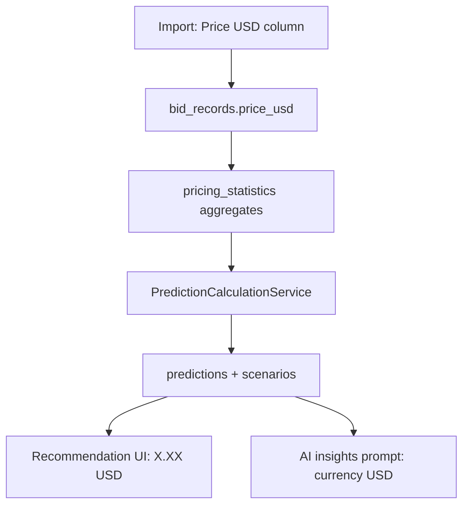

# TenderAI USD Standardization Report

**Date:** 2026-05-31  
**Scope:** Recommendation workflow (import → statistics → prediction → storage → result UI → AI insights)

---

## 1. Currency audit findings

### Import → Bid records

| Aspect | Finding |
|--------|---------|
| Calculation input | `price_usd` from import normalization (`ImportValidatorService`, `ImportRowStandardizationService`) |
| Stored analytics field | `bid_records.price_usd` |
| `currency_id` on bid | Set from `country.default_currency_id` (e.g. SAR for Saudi Arabia) — **metadata only**, not used in stats math |
| Conversion at import | None; importers must supply **Price USD** column |

### Pricing statistics (`pricing_statistics`)

| Aspect | Finding |
|--------|---------|
| Calculation currency | **USD** — all aggregates use `BidRecord::price_usd` (`PricingStatisticsService::buildAttributes`) |
| Pre-fix metadata | `currency_id` was the **mode** of bid-record `currency_id` (often SAR/AED for GCC tenders) |
| Post-fix metadata | `currency_id` forced to **USD** to align metadata with values |

### Prediction calculation (`prediction_calculations`)

| Aspect | Finding |
|--------|---------|
| Calculation currency | **USD** — formula reads `PricingStatistic` unit price fields (USD-derived) |
| Pre-fix `currency_id` | Inherited `pricing_statistics.currency_id` (could be local) |
| Post-fix `currency_id` | Always **USD** on new predictions |

### Prediction storage (`predictions`, `prediction_scenarios`)

| Aspect | Finding |
|--------|---------|
| Price fields | Numeric USD amounts (`recommended_price`, `market_calculated_price`, `final_recommended_price`, scenario prices) |
| Pre-fix display | UI used `prediction.currency.symbol` (e.g. `SR`, `JD`, `$`) |
| Mismatch | **Values were USD; labels could show local symbols** |

### Result page (`/ai/recommendations/{uuid}`)

| Aspect | Finding |
|--------|---------|
| Pre-fix display currency | `$prediction->currency?->symbol` with fallback `$` |
| Source of wrong symbol | Stored `currency_id` from statistics / prediction pipeline |
| AI insights | Prompt did not state USD; model could mention local currencies |

### Were calculations already USD?

**Yes.** The recommendation engine has consistently computed from `price_usd` and USD-based statistics. The primary bug was **display and metadata** presenting local currency symbols while numbers were USD.

---

## 2. Files modified

| File | Change |
|------|--------|
| `app/Support/RecommendationCurrency.php` | **New** — USD formatting helper (`1.25 USD`) and USD `currency_id` resolver |
| `app/Services/Statistics/PricingStatisticsService.php` | `resolveCurrencyId()` always returns USD |
| `app/Services/Prediction/PredictionCalculationService.php` | New predictions store USD `currency_id` |
| `app/Services/AI/PredictionNarrativeService.php` | Prompt rules + payload `pricing_currency` / `currency: USD` |
| `resources/views/ai/recommendations/show.blade.php` | All price cards/details use `RecommendationCurrency::format()`; USD notice |
| `resources/views/predictions/index.blade.php` | History list prices show `X.XX USD` |
| `resources/views/reports/history.blade.php` | Report history prices show `X.XX USD` |
| `tests/Unit/RecommendationCurrencyTest.php` | **New** |
| `tests/Feature/PredictionUiTest.php` | USD display with SAR `currency_id` on prediction |
| `tests/Feature/PricingStatisticsEngineTest.php` | Statistics `currency_id` is USD when bids use SAR |
| `tests/Feature/AINarrativeLayerTest.php` | Prompt USD context; prediction `currency_id` is USD |

---

## 3. Display changes

- **Format:** `{amount} USD` (e.g. `1.20 USD`, `12.5000 USD` for 4-decimal breakdowns)
- **Never on recommendation surfaces:** `SR`, `JD`, `AED`, `€`, or `$`-only without USD suffix on recommendation pages
- **Banner on result page:** States that historical data, statistics, recommendations, and AI insights use USD
- **Backward compatibility:** Stored numeric values unchanged; only presentation and new-record `currency_id` metadata updated

---

## 4. Discovered currency inconsistencies

1. **Display vs calculation:** Result page showed `currency.symbol` while math used `price_usd` — **fixed (display layer)**.
2. **`pricing_statistics.currency_id`:** Could be SAR when majority of bids had country default currency — **fixed (metadata)**.
3. **`predictions.currency_id`:** Copied from statistics — **fixed for new predictions**.
4. **`bid_records.currency_id`:** Still reflects country default (intentional provenance; not used in recommendation math).
5. **`original_awarded_price`:** Local awarded price from import; **not** used in recommendation engine.
6. **Non-recommendation pages** (drugs, tenders, dashboard): May still show `$` or other formats — out of scope unless extended.

No silent currency conversion was added.

---

## 5. Remaining currency risks

| Risk | Mitigation / note |
|------|------------------|
| Legacy rows with non-USD `currency_id` | Display ignores relation; uses `RecommendationCurrency::format()` |
| Re-run statistics refresh | Will rewrite `pricing_statistics.currency_id` to USD on next calculation |
| Import rows missing `price_usd` | Excluded from materialization (existing guard) |
| AI model ignoring prompt | Prompt explicitly forbids local currencies; regenerate insights after deploy |
| Future multi-currency feature | Requires dedicated conversion module; do not reuse `currency.symbol` on recommendation UI |

---

## 6. Tests added/updated

- `tests/Unit/RecommendationCurrencyTest.php` — format and USD id resolution
- `tests/Feature/PredictionUiTest.php` — `test_show_page_displays_prices_in_usd_even_when_prediction_currency_is_local`
- `tests/Feature/PricingStatisticsEngineTest.php` — `test_pricing_statistics_currency_metadata_is_always_usd`
- `tests/Feature/AINarrativeLayerTest.php` — `test_insights_prompt_includes_usd_currency_context`; USD `currency_id` on orchestrated prediction

---

## 7. Pipeline diagram (USD source of truth)

---

## 8. Goal status

Recommendation results are now aligned with the data model: **USD is the official pricing currency** for calculation, metadata on new statistics/predictions, display, and AI strategic insights.
